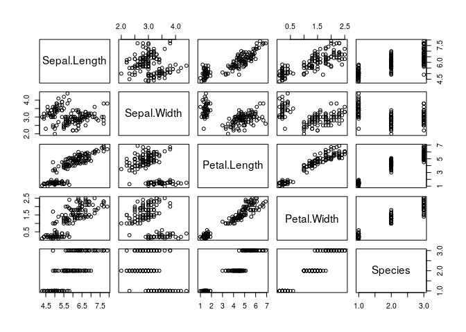

<!--Author
章タイトル：Title
章の概要：Summary-->

``` r
> print("foo")
[1] "foo"
```

図3.1はあやめの図です。

``` r
> plot(iris)
```



表3.1はあやめのデータです。

``` r
> knitr::kable(head(iris), caption = "(#tab:iris) A table.")
```

| Sepal.Length | Sepal.Width | Petal.Length | Petal.Width | Species |
| -----------: | ----------: | -----------: | ----------: | :------ |
|          5.1 |         3.5 |          1.4 |         0.2 | setosa  |
|          4.9 |         3.0 |          1.4 |         0.2 | setosa  |
|          4.7 |         3.2 |          1.3 |         0.2 | setosa  |
|          4.6 |         3.1 |          1.5 |         0.2 | setosa  |
|          5.0 |         3.6 |          1.4 |         0.2 | setosa  |
|          5.4 |         3.9 |          1.7 |         0.4 | setosa  |

表3.1 A table.
